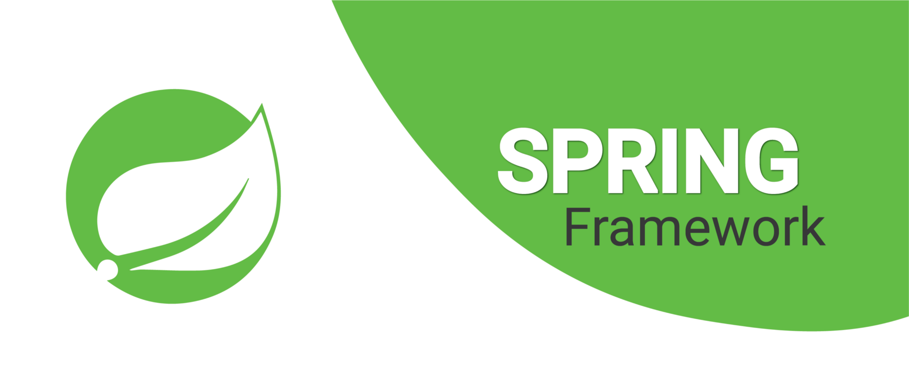
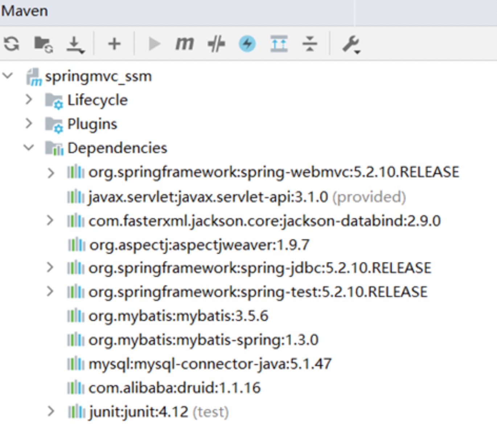
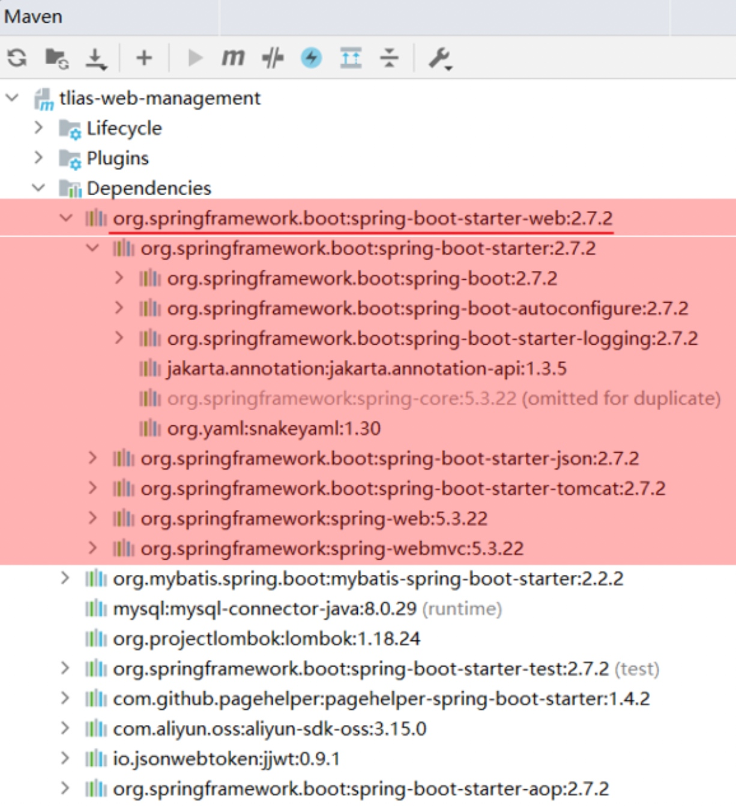
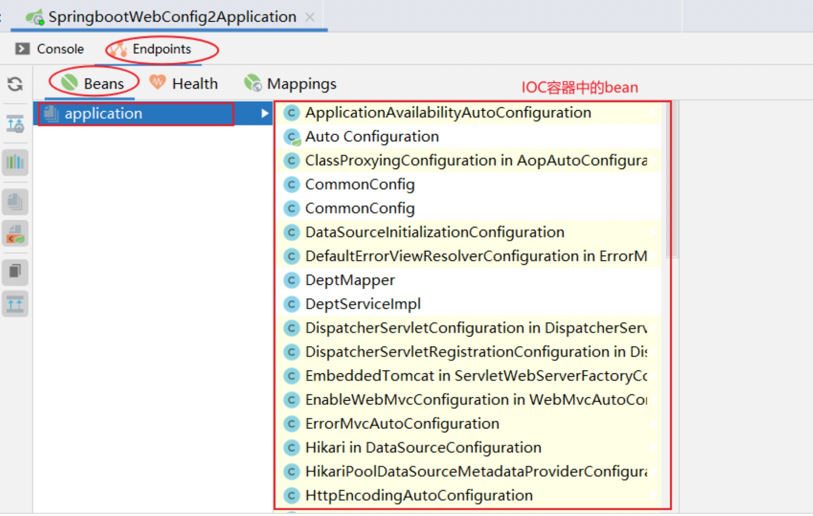
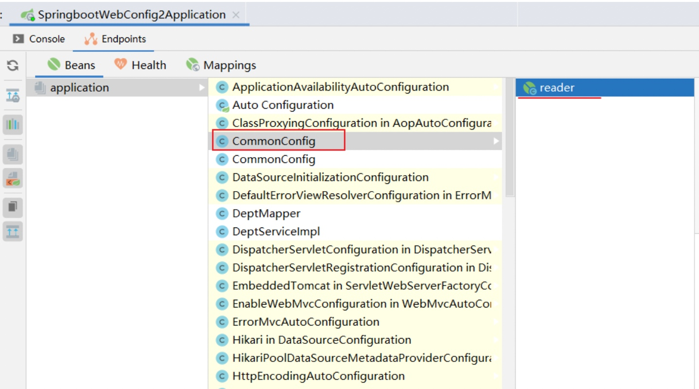
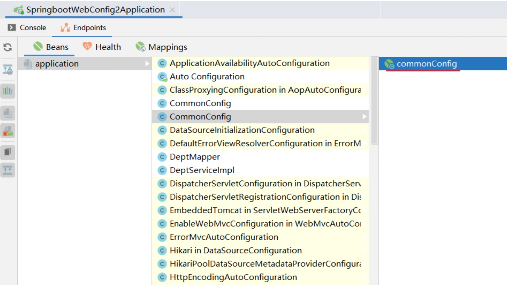
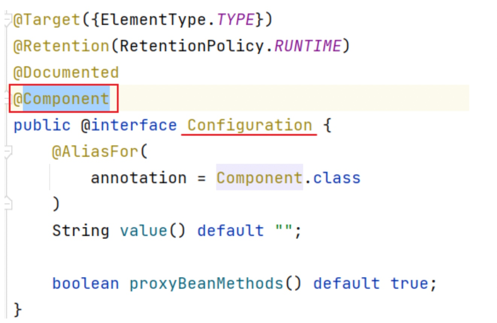
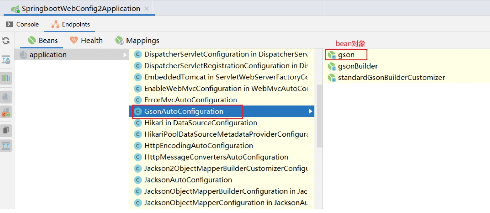
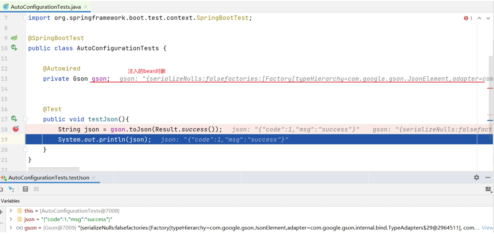

# 繁琐的Spring


Spring是目前世界上最流行的Java框架，直接基于Spring框架进行Web项目的开发，会比较繁琐。
繁琐主要体现在两个地方：
1. 在`pom.xml`中依赖配置比较繁琐，需要自己去找到对应的依赖以及进行版本管理，否则就会出现版本冲突问题。
2. 项目开发时，需要在Spring的配置文件中做`大量的配置`，这就造成入门难度较大，学习成本较高

# 简单的Spring Boot

因为Spring存在这些问题，官方在Spring4.0版本后，推出了一个全新的框架：`SpringBoot`
通过 SpringBoot来简化Spring框架的开发(是简化不是替代)。我们直接基于SpringBoot来构建Java项目，会让我们的项目开发更加简单，更加快捷。让我们能够集中精力关注业务功能的开发

SpringBoot框架之所以使用起来更简单更快捷，是因为SpringBoot框架底层提供了两个非常重要的功能：
1. `起步依赖`
2. `自动配置`

# 起步依赖


如果使用Spring框架进行web程序的开发，此时我们就需要手动引入web程
序开发所需要的一些依赖。包括

- spring-webmvc依赖：这是Spring框架进行web程序开发所需要的依赖
- servlet-api依赖：Servlet基础依赖
- jackson-databind依赖：JSON处理工具包
- 如果要使用AOP，还需要引入aop依赖、aspect依赖

需要自己保证版本匹配，否则就可能会出现`版本冲突`问题


而使用SpringBoot后, 只需要web开发的起步依赖：`springboot-starter-web`。

其他的依赖如json、web、webmvc、tomcat自动的通过`Maven`的`依赖传递`引入到项目, 并且能统一进行版本管理,再也不会版本冲突了, 非常方便快捷

# 起步依赖清单
SpringBoot完整的起步依赖清单如下图所示


# 自动配置
当Spring容器启动后，配置类、bean对象自动存入IOC容器中，不需要我们手动去声明，从而简化了开发，省去了繁琐的配置操作。

打开idea，看下自动配置的效果    

运行SpringBoot项目


有两个CommonConfig，在第一个CommonConfig类中定义了一个bean对象，bean对象的名字叫reader。

第二个CommonConfig的bean名字叫commonConfig


怎么生成这样一个IOC bean对象呢？



在CommonConfig配置类上添加了一个注解`@Configuration`，而@Configuration底层就是`@Component`

所以配置类变成SpringIOC容器当中的一个bean对象

在IOC容器中除了自定义bean，还有很多配置类，这些配置类都会在SpringBoot启动的时候加载进来, 并生成很多的bean对象。


比如：配置类GsonAutoConfiguration里面有一个bean叫gson, 类型为com.google.gson.Gson, 是谷歌提供的用来处理JSON格式数据的工具类。

如何使用这些配置类中生成的bean对象呢

使用`@Autowired`就自动注入了：
```
import com.google.gson.Gson;
import com.itheima.pojo.Result;
import org.junit.jupiter.api.Test;
import org.springframework.beans.factory.annotation.Autowired;
import org.springframework.boot.test.context.SpringBootTest;

@SpringBootTest
public class AutoConfigurationTests {
    @Autowired
    private Gson gson;
    
    @Test
    public void testJson(){
        String json = gson.toJson(Result.success());
        System.out.println(json);
    }
}
```
添加断点，使用debug模式运行测试类程序：


可以看到, Gson对象自动注入到我们自定义的json bean变量中

这个bean对象怎么来的？

SpringBoot项目在启动时将依赖jar包当中所定义的配置类以及bean加载到SpringIOC容器中的, 并通过自动配置完成了bean对象的创建