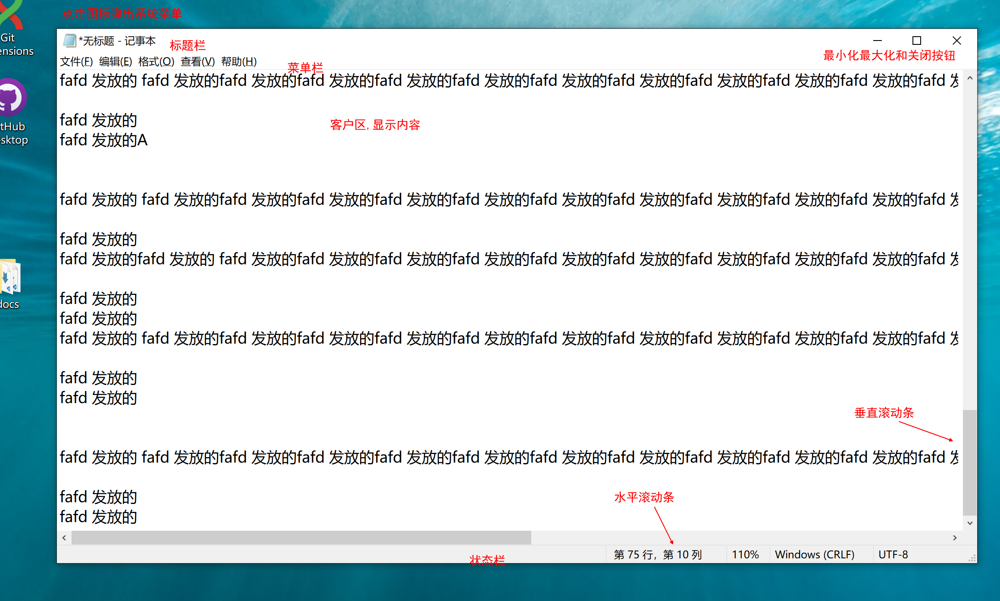
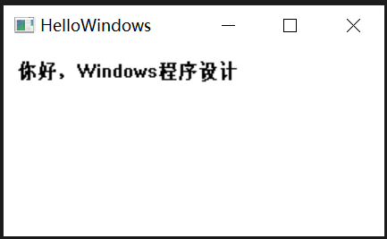
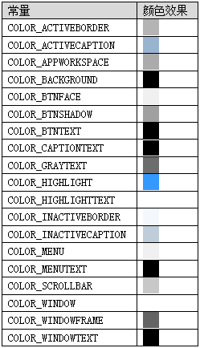

# 认识Windows窗口
- 图形用户界面(GUI)是指采用图形方式显示程序界面。

- 启动一个程序,桌面就显示一块矩形区域,被称为窗口,用户可以在窗口中操作应用程序,进行数据的管理和编辑

窗口包含如下元素


1. 标题栏和窗口标题
2. 系统菜单按钮
3. 菜单栏
4. 最小化,最大化和关闭按钮
5. 滚动条
6. 窗口边框
7. 客户区: 窗口内部的矩形区域, 指出了标题栏,菜单栏,工具栏,状态栏,滚动条和边框之外的区域,程序在这里显示文本,图形,子窗口或其他信息, 非客户去:指出了客户去之外的区域,包括标题栏,菜单栏,工具栏,状态栏,股东条和边框等
8. 状态栏

一个窗口不一定就是一个程序,它可能是程序的一部分,一个程序可以创建多个子窗口,程序的主窗口都是顶级窗口, 顶级窗口(Top-Level)指父窗口是桌面的程序窗口

一个程序并不一定必须要有窗口,比如悄悄运行在后台的木马程序就不会显示一个窗口, 如果一个程序不想和用户进行交互,它可以选择不创建窗口

# 第一个窗口程序
```
#include <Windows.h>
#include <tchar.h> // _tcslen 函数需要该头文件

#pragma comment(lib, "Winmm.lob") // 播放声音的PlaySound函数需要Winmm库
// 函数声明,窗口过程
LRESULT CALLBACK WindowProc(HWND hwnd, UINT uMsg, WPARAM wParam,LPARAM lParam);

int WINAPI WinMain(HINSTANCE hInstance, HINSTANCE hPrevInstance, LPSTR lpCmdLine, int nCmdShow)
{
    WNDCLASSEX wndclass;                        // RegisterClassEx函数用的WNDCLASSEX结构
    TCHAR szClassName[] = TEXT("MyWindow");     // RegisterClassEx函数注册的窗口类的名称
    TCHAR szAppName[] = TEXT("HelloWindows");   // 窗口标题
    HWND hwnd;                                  // CreateWindowEx函数创建的窗口的句柄
    MSG msg;                                    // 消息循环所用的消息结构体

    wndclass.cbSize = sizeof(WNDCLASSEX);
    wndclass.style = CS_HREDRAW | CS_VREDRAW;
    wndclass.lpfnWndProc = WindowProc;
    wndclass.cbClsExtra = 0;
    wndclass.cbWndExtra = 0;
    wndclass.hInstance = hInstance;
    wndclass.hIcon = LoadIcon(NULL, IDI_APPLICATION);
    wndclass.hCursor = LoadCursor(NULL, IDC_ARROW);
    wndclass.hbrBackground = (HBRUSH)GetStockObject(WHITE_BRUSH);
    wndclass.lpszMenuName = NULL;
    wndclass.lpszClassName = szClassName;
    wndclass.hIconSm = NULL;
    RegisterClassEx(&wndclass);

    hwnd = CreateWindowEx(0, szClassName, szAppName, WS_OVERLAPPEDWINDOW,
        CW_USEDEFAULT, CW_USEDEFAULT, 300, 180, NULL, NULL, hInstance, NULL);

    ShowWindow(hwnd, nCmdShow);
    UpdateWindow(hwnd);

    while (GetMessage(&msg, NULL, 0, 0) != 0)
    {
        TranslateMessage(&msg);
        DispatchMessage(&msg);
    }

    return msg.wParam;
}

LRESULT CALLBACK WindowProc(HWND hwnd, UINT uMsg, WPARAM wParam, LPARAM lParam)
{
    HDC hdc;
    PAINTSTRUCT ps;
    TCHAR szStr[] = TEXT("你好，Windows程序设计");

    switch (uMsg)
    {
    case WM_CREATE:
        PlaySound(TEXT("成都(两会版).wav"), NULL, SND_FILENAME | SND_ASYNC/* | SND_LOOP*/);
        return 0;

    case WM_PAINT:
        hdc = BeginPaint(hwnd, &ps);
        TextOut(hdc, 10, 10, szStr, _tcslen(szStr));
        EndPaint(hwnd, &ps);
        return 0;

    case WM_DESTROY:
        PostQuitMessage(0);
        return 0;
    }

    return DefWindowProc(hwnd, uMsg, wParam, lParam);
}

```
编译运行程序,计算机响起"春风吹过的时候,我矗立在街头..."", 并在客户区左上角显示,你好,window程序设计, 程序界面如图所示

程序有标题栏,系统菜单,最小化,最大化和关闭按钮,拖动窗口边框可以改变窗口大小,这个窗口包含了典型窗口的大部分特征

刚刚接触Windows程序设计的读者可能觉得这个程序太过复杂,但是这个程序是大多数窗口程序的模板,以后写心得程序,只要复制过来修改即可

# WinMain 的执行流程
1. 抓测窗口类(RegisterClassEX)
2. 创建窗口(CreateWindowEX)
3. 显示窗口(ShowWindow), 刷新窗口客户区(UpdateWindow)
4. 进入无限的消息获取,分发的玄幻:获取消息(GetMessage),转换消息(TranslateMessage),将消息分发到回调函数WindowProc进行处理(DispatchMessage)
下面介绍每一步


# RegisterClassEx 注册窗口类
RegisterClassEx,Ex是扩展的意思,它是Win16中RegsiterClass 函数的扩展,该函数用于注册一个窗口类,在下一步调用CreateWindowEx函数创建窗口的时候使用

```
ATOM WINAPI RegisterClassEx(const *WNDClASSEX *lpwcx);
```
函数返回值ATOM是原子的意思,就是说RegisterClassEx 函数会返回一个独一无二的值就唯一代表我们注册的窗口类,我们通常使用WNDCLASSEX结构中指定的窗口类名(WNDCLASSEX lpszClassName字段)

如果函数执行成功,返回类原子值,如果执行失败,通过调用GetLastError函数获取错误代码

参数lpwcs是一个指向WNDCLASSEX结构的指针,调用RegisterClassEX函数之前必须初始化结构

```
typedef struct tagWNDCLASSEX {
    UNIT cbSize; // 该结构的大小,以字节为单位,设置为sizeof(WNDCLASSEX)
    UNIT style, // 用这个窗口类创建窗口的具体样式
    WINDPROC lpfnWndProc // 指定窗口过程,所以基于这个窗口类创建的窗口都使用这个窗口过程
    int cbClsExtra, // 紧跟在WNDCLASSEX结构后面的附加字节数,用来存放自定义数据
    int cbWndExtra, //紧跟在窗口实例后面的附加字节数,用来存放自定义数据
    HINSTANCE hInstance, // 实例句柄
    HICON hIcon,// 窗口类创建的窗口所用的图标资源句柄
    HCURSOR hCursor // 光标资源句柄
    HBRUSH hbrBackground // 背景画刷句柄
    LPCTSTR  lpszMenuName // 窗口类的菜单资源名称
    LPCTSTR lpszClassName // 窗口类名称,调用CreateWindowEX 函数创建窗口时需要使用窗口类名称
    HICON hIconSm//窗口所用的小图标句柄
} WNDCLASSEX, *PWNDCLASSEX;
```
第二个字段style指定窗口类样式,常见的类别如下
```
#define CS_VREDRAW          0x0001 // 当窗口高度发生变化后,重新绘制整个窗口
#define CS_HREDRAW          0x0002 // 当窗口宽度发生变化后,重新绘制整个窗口
#define CS_DBLCLKS          0x0008 //当用户双击鼠标后,向窗口过程发送双击消息WM_LBUTTONDBCLK
#define CS_OWNDC            0x0020 // 为窗口类的每个窗口分配唯一的设备环境
#define CS_CLASSDC          0x0040 // 分配一个设备环境基于窗口类的所有窗口共享
#define CS_PARENTDC         0x0080 // 将子窗口裁剪矩形设置为父窗口的裁剪矩形,以便子窗口可以在父窗口绘制
#define CS_NOCLOSE          0x0200 // 禁用关闭按钮,系统菜单的关闭按钮会消息
#define CS_SAVEBITS         0x0800
#define CS_BYTEALIGNCLIENT  0x1000
#define CS_BYTEALIGNWINDOW  0x2000
#define CS_GLOBALCLASS      0x4000 // 表示窗口类时应用程序全局类
```

CS_DBLCLKS 样式设置双击事件
窗口过程加上WM_LBUTTONDBLCL 消息的处理
```
case WM_LBUTTONDBCLK:
 MessageBox(hwnd, TEXT("客户区被双击"), TEXT("提示"),MB_OK);
 return 0;
```
重新编译运行,双击客户区会弹出消息框

第三个字段lpfnWndProc指定窗口过程,所有基于这个窗口类的窗口都使用这个窗口过程, 窗口过程的概念稍后讲解,只需要知道程序运行以后会发生很多事件,如窗口创建,窗口重绘,窗口尺寸改变,鼠标双击,程序关闭等事件,操作系统会把这些事件通知应用程序,应用程序在lpfnWndProc字段指定的窗口过程(函数)中处理这些事件,WNDPRCO是窗口过程的指针类型

第六个字段 hInstance指定窗口类的窗口过程所属的实例句柄,也就是所述模块.
第7个字段HIcon指定图标句柄,这个句柄用于生成可执行程序文件图标,Widnows已经定义了一些图标,程序可以使用资源文件中自定义的图标,通过LoadIcon 或 LoadImage 函数获取

资源文件在编译后就会被打包到可执行文件中, LoadIcon函数用于从应用程序加载指定的图标资源
```
HICON LoadIcon(
    HINSTANCE hInstance // 程序实例句柄(模块句柄)
    LPCSTR lpIconName // 要记在的图标资源名称
)
```
```
#define IDI_APPLICATION     MAKEINTRESOURCE(32512) // 默认应用程序图标
#define IDI_HAND            MAKEINTRESOURCE(32513) // 错误提示样式图标
#define IDI_QUESTION        MAKEINTRESOURCE(32514) //问号图标
#define IDI_EXCLAMATION     MAKEINTRESOURCE(32515) // 感叹号图标
#define IDI_ASTERISK        MAKEINTRESOURCE(32516) // 信息提示
```

第8个字段 hCursor 指定窗口所用的光标资源句柄
使用 LoadCursor 函数加载光标资源
```
HCURSOR WINAPI LoadCursor(
    HINSTANCE hInstance,
    LPCTSTR lpCursorName // 光标资源名称
)
```
```
#define IDC_ARROW           MAKEINTRESOURCE(32512) // 标准箭头
#define IDC_IBEAM           MAKEINTRESOURCE(32513) // 工字
#define IDC_WAIT            MAKEINTRESOURCE(32514) // 等待(忙碌)
#define IDC_CROSS           MAKEINTRESOURCE(32515) // 十字线
#define IDC_UPARROW         MAKEINTRESOURCE(32516) // 垂直箭头
```
第9个字段 hbrBackground 指定窗口类创建的窗口使用的背景画刷句柄, 可以使用标准系统颜色, HBRUSh 是Windows定义的画刷句柄类型
GetStockObject函数用于获取备用画笔,画刷,字体等句柄
```
HGDIOBJ GetStockObject(int fnObject);
fnObject 参数指定备用对象的类型,对于画刷来说,可以是下表所列的值
```
```
#define WHITE_BRUSH         0 // 白色画刷
#define LTGRAY_BRUSH        1 // 浅灰色
#define GRAY_BRUSH          2 // 灰色
#define DKGRAY_BRUSH        3 // 深灰色
#define BLACK_BRUSH         4 // 黑色
#define NULL_BRUSH          5 // 空画刷,什么也不画
#define HOLLOW_BRUSH        NULL_BRUSH // 空画刷
#define WHITE_PEN           6 // 白色画笔
#define BLACK_PEN           7 // 黑色画笔
```
如果函数执行成功, 返回指定备用对象的HGDIOBJ 类型句柄,如果函数执行失败,则返回NULL

也可以使用标准系统颜色,下面是可用的部分标准系统颜色
```
#define COLOR_SCROLLBAR         0
#define COLOR_BACKGROUND        1
#define COLOR_ACTIVECAPTION     2
#define COLOR_INACTIVECAPTION   3
#define COLOR_MENU              4
#define COLOR_WINDOW            5
#define COLOR_WINDOWFRAME       6
#define COLOR_MENUTEXT          7
#define COLOR_WINDOWTEXT        8
#define COLOR_CAPTIONTEXT       9
#define COLOR_ACTIVEBORDER      10
#define COLOR_INACTIVEBORDER    11
#define COLOR_APPWORKSPACE      12
#define COLOR_HIGHLIGHT         13
#define COLOR_HIGHLIGHTTEXT     14
#define COLOR_BTNFACE           15
#define COLOR_BTNSHADOW         16
#define COLOR_GRAYTEXT          17
#define COLOR_BTNTEXT           18
#define COLOR_INACTIVECAPTIONTEXT 19
#define COLOR_BTNHIGHLIGHT      20
```
对应的效果如下图


注册后就可以使用注册的窗口类去创建具体的窗口类了

# 创建窗口(CreateWindowEX)
注册窗口类后,就可以在窗口类的基础上通过调用CreateWindowEX来添加其他的属性来创建窗口了, 可以创建具有扩展样式的重叠窗口,弹出窗口和子窗口

HWND WINAPI CreateWindowEx(
    _In_ DWORD dwExStyle, // 窗口的扩展窗口样式
    _In_opt_ LPCSTR lpClassName, // RegisterClassEx 函数注册的函数雷鸣
    _In_opt_ LPCSTR lpWindowName, // 窗口标题
    _In_ DWORD dwStyle, // 窗口的窗口样式
    _In_ int X, // 窗口的初始水平位置,像素单位
    _In_ int Y, // 窗口的初始垂直位置,像素单位
    _In_ int nWidth, // 窗口的初始宽度,像素单位
    _In_ int nHeight, // 窗口的初始高度,像素单位
    _In_opt_ HWND hWndParent, // 窗口的父窗口
    _In_opt_ HMENU hMenu, // 菜单句柄
    _In_opt_ HINSTANCE hInstance, // 与窗口关联的实例句柄(模块句柄)
    _In_opt_ LPVOID lpParam); // 额外参数
}

第一个参数 dwExStyle  指定窗口的扩展样式, dwExStyle , WS 表示 Windows Style 缩写,下面是不分窗口样式
```
WS_EX_WINDOWEDGE: 窗口边框带有凸起的边缘
WS_EX_CLIENTEDGE: 凹陷的边缘
WS_EX_OVERLAPPEDWINDOW: 窗口是一个重叠窗口
WS_EX_ACCEPTFILES: 窗口接受拖放文件
WS_EX_TOPMOST: 窗口始终保持在最顶层
WS_EX_LAYERED: 分层或透明窗口,该样式可以实现一些混合特效
WS_EX_TOOLWINDOW: 创建一个工具窗口,通用用作浮动工具条
```

第二个参数lpClassName 指定为RegisterClassEx函数注册的窗口类型
第3个参数lpWindowName 指定窗口标题,通常窗口类型和窗口标题可以使用相同的名称
第4个参数dwStyle指定窗口样式,窗口样式是一些以WS_开头的预定义值,如下列出分窗口样式
```
#define WS_OVERLAPPED       0x00000000L // 窗口是重叠窗口,重叠窗口具有标题栏和边框
#define WS_POPUP            0x80000000L // 窗口是弹出窗口,该样式不能与WS_CHILD样式一起使用
#define WS_CHILD            0x40000000L // 窗口是子窗口,具有该样式的窗口不能有菜单栏,该样式不能与WS_POPUP 样式一起使用
#define WS_MINIMIZE         0x20000000L // 窗口最初最小化
#define WS_VISIBLE          0x10000000L // 窗口最初可见,如果不设置这个样式,窗口将不可见
#define WS_DISABLED         0x08000000L // 窗口最初被禁用,禁用的窗口无法接受用户的输入
#define WS_CLIPSIBLINGS     0x04000000L // 不对兄弟窗口(属于同一个父窗口的多个子窗口)进行绘制,以后可能会用到
#define WS_CLIPCHILDREN     0x02000000L // 父窗口不对子窗口区域进行绘制
#define WS_MAXIMIZE         0x01000000L // 窗口最初被最大化
#define WS_CAPTION          0x00C00000L // 窗口有标题栏(WS_BORDER)
#define WS_BORDER           0x00800000L // 窗口有细线边框
#define WS_DLGFRAME         0x00400000L // 创建一个带有对话框边框的窗口,这种样式的窗口没有标题栏
#define WS_VSCROLL          0x00200000L // 垂直滚动条
#define WS_HSCROLL          0x00100000L // 水平滚动条
#define WS_SYSMENU          0x00080000L // 窗口标题栏上有一个系统菜单,还必须同时指定WS_CAPTION 样式


#define WS_MINIMIZEBOX      0x00020000L // 窗口有最小化按钮
#define WS_MAXIMIZEBOX      0x00010000L // 窗口有最大化按钮


#define WS_TILED            WS_OVERLAPPED
#define WS_ICONIC           WS_MINIMIZE // 窗口最初被最小化
#define WS_SIZEBOX          WS_THICKFRAME // 通过边框调整窗口大小
#define WS_TILEDWINDOW      WS_OVERLAPPEDWINDOW
```

CreateWindowEx 函数可以创建具有扩展窗口样式的重叠窗口，弹出窗口和子窗口，如果需要创建一个常见的重叠敞口，则使用 WS_OVERLAPPEDWINDOW 样式即可，具有标题栏，系统菜单，可调边框，最小化，最大化和关闭按钮，如果需要创建一个弹出窗口，则使用 WS_POPUPWINDOW | WS_CAPTION 样式即可，如果需要创建一个子窗口，则使用WS_CHILD样式
第5个和第6个参数x ,y 分别制定窗口左上角相对于屏幕左上角初始水平和垂直位置，以像素为单位，CW——userdefault表示使用Windows设置的默认值

hWndParent 指定窗口的父窗口，如果创建子窗口，则需要指定父窗口的句柄，以便父子窗口之间进行同行，本程序是顶级窗口程序，设置为NULL即可
顶级窗口的父窗口是桌面窗口， 重叠窗口和弹出窗口都可以是顶级窗口， 他们的坐标定位相对于屏幕左上角，顶级窗口作为程序的主窗口，
子窗口必须有父窗口，父窗口可以是层叠窗口，弹出窗口，甚至是其他子窗口，子窗口从父窗口的客户去左上角定位，而不是从屏幕左上角定位，可以为子窗口设置标题栏，最小化，最大化按钮，边框和滚动条，但不能设置菜单
第10个参数hMenu指定菜单句柄，本程序没有菜单，设置为NULL，如果创建的是子窗口，则该参数设置为子窗口ID
第11个参数hInstance 指定与窗口关联的实例句柄，也就是窗口所属的模块
第12个参数lParam可以指定为只想某些数据结构的指针

CreateWindowEX 函数执行成功，则返回新创建的窗口的窗口句柄，如果函数执行失败，则返回为NULL，Windows系统中，每一个窗口都有一个句柄，在程序中可以使用句柄对窗口进行引用，许多Windows API 都以窗口句柄为参数，通过窗口句柄Windows就可以知道该函数要对哪个窗口进行操作，如果一个程序创建了多个窗口，那个每个窗口都具有不同的窗口句柄

# 显示窗口 (ShowWindow) 和刷新窗口客户去(UpdateWindow)
光标定位到ShowWindow(hwnd, nCmdShow)一行，F5 开始调试，程序窗口还没有显示出来，但如果读者打开任务管理器，则会发现HelloWindows.exe进程已经存在，窗口已经在Windows内部被创建了，ShowWindow函数用于设置指定窗口的显示状态
```
BOOL WINAPI ShowWindow(
    HWND hwnd // 窗口句柄
    int nCmdShow // 窗口的显示方式
)
```
第一次调用ShowWindow 时，nCndShow参数可以指定为WinMain函数的值，SW_SHOWDEFAULT ，表示激活并显示窗口
ShowWindow 函数作用是设置指定窗口的显示状态，如果程序以后需要设置窗口的显示状态，有如下的值
```
#define SW_HIDE             0 // 隐藏窗口
#define SW_SHOWNORMAL       1 // 激活并显示一个窗口，如果窗口最小化或最大化，则系统会将其还原到原始大小
#define SW_SHOWMINIMIZED    2 // 激活窗口并将其最小化
#define SW_SHOWMAXIMIZED    3 // 激活窗口并显示为最大化窗口
#define SW_MAXIMIZE         3 // 激活窗口并显示为最大化
#define SW_SHOWNOACTIVATE   4 // 显示一个窗口,如果窗口最小化或最大化,则系统会还原到原始大小和位置,不同之处就是未激活窗口
#define SW_SHOW             5 // 激活窗口并以当前大小和位置显示窗口
#define SW_MINIMIZE         6 // 最小化窗口
#define SW_SHOWMINNOACTIVE  7 // 最小化窗口,未激活状态
#define SW_SHOWNA           8 // 以当前大小和位置显示窗口,类似于SW_Show,不同之处在于未激活窗口
#define SW_RESTORE          9 // 激活并恢复显示窗口,如果窗口最小化或最大化,则系统会将其还原到原始大小
#define SW_SHOWDEFAULT      10 // 根据传递给CreateProcess 函数的STARUUPINFO 结构中指定的SW_值显示状态
#define SW_FORCEMINIMIZE    11 // 最小化窗口(即使拥有该窗口的线程没有响应),仅当最小化其他线程的窗口时才使用该标志
#define SW_MAX              11
```
// 如果窗口以前可见,则返回值为非0,如果窗口以前隐藏,则返回值为0

# UpdateWindow, 
函数通过向窗口发送WM_PAINT 消息来更新窗口的客户区,该函数将WM_PAINT 消息直接发送到窗口的窗口过程,绕过应用程序的消息队列,即UpdateWindow 函数导致窗口过程 WindowProc 执行 case WM_PAINT 逻辑,调用 TextOut  函数输出文字, 消息机制将在下一节详细介绍
BOOL updateWindow(HWND hwnd); // 更新哪个窗口
如果函数执行成功,则返回TRUE,如果失败,返回FALSE

# 消息循环
程序运行以后会发生很多事件,比如窗口创建,窗口重绘,窗口尺寸改变, 鼠标双击, 程序关闭等事件, Windows 会把这些事件通知应用程序, Windows 为每个应用程序维护消息队列, 事件发生以后, Windows 会自动将其转换成消息, 并放到消息队列中, 应用程序通过调用 GetMessage 函数从消息队列中获取消息, 调用TranslateMessage 函数转换消息, 调用 DispatchMessage 函数分发消息到窗口过程, 窗口过程处理完一个小希后, 将控制权返回给 Windows, 然后 DispatchMessage 函数返回, 这一轮操作完成后,又会进行下一轮的消息获取,转换和分发

GetMessage 函数用于从调用线程的消息队列中获取消息:
```
BOOL WINAPI GetMessage (
    LPMSG lpMsg, // MSG 结构用于存放消息的具体信息
    HWND hWnd, // 要获取哪个窗口的消息
    UNIT uMsgFilterMin, // 要获取的消息的最小值
    UINT wMsgFilterMax, // 要获取的消息最大值
)
```
第一个参数 lpMsg 指向 MSG 结构的指针, 用于存放消息的具体信息, 即函数在获取一个消息以后,会把这个消息的具体信息存放在这个结构中

typedef struct tagMSG {
    HWND hwnd, // 哪个窗口发生的消息
    UNIT message, // 消息类型, 以WM_开头(Windows Message)
    WPARAM wParam // 消息参数, 取决于具体的消息类型
    LPARAM lParam,// 消息参数, 其含义取决于具体的消息类型
    DWORD time // 消息发生的事件
    POINT pt // 消息发生时的光标位置,屏幕坐标
} MSG *PMSG, NEAR *NPMSG, FAR *LPMSG;
pt 字段时一个 POINT 结构,表示消息发生时的光标位置, 该结构在windef.h头文件中定义

```
typedef struct tagPOINT {
    LONG x;
    LONG y
} POINT, **PPOINT, NEAR *NPPOINT, FAR *LPPOINT
```
TranslateMessage 函数将按键消息转换成字符消息,然后将字符消息发送到调用线程中,下次线程调用GetMessage函数时即可获取这个字符消息
BOOL WINAPI translateMessage(const MSG *lpMsg) // 从GetMessage 函数获取到的MSG

如果消息被转换,即一个字符消息被发送到线程的消息队列,则返回值为0,如果消息没有转换,即没有字符消息被发送到线程的消息队列,则返回值为0

窗口显示后,程序需要处理来自用户的键盘输入和鼠标输入灯,用户按下一个按键时会产生WM_KEYDOWN消息,送开按键的时候会产生WM_CHAR消息,这样一来我们就可以在窗口过程中处理WM_CHAR消息来判断用户按下了哪一个字符按键,即有了TranslateMessage函数的帮助,对于字符按键我们不需要处理WM_KEYDOWN 和WM_KEYUP消息,只需处理WM_CHAR消息即可,在窗口过程中添加如下代码
```
case WM_CHAR:
{
    TCHAR szChar[16] = {0};
    wsprintf(szChar,TEXT("用户按下了字符"),wParam);
    MessageBOX(hwnd, szChar, Text("提示"),MB_OK);
    return 0;
}
```

编译运行程序,输入法切换为英文状态,每当用户按下一个可现实字符,就会弹出消息框,如果按下的是Ctrl, Shift Alt 一类的按键,则不会产生WM_CHAR消息,如果把 TranslateMessage 注释掉,则不会产生WM_CHAR消息,关于键盘和鼠标输入情况,以后还会详细介绍
DispatchMessage 函数用于把GetMessage函数获取到的消息分发到窗口过程
LRESULT WINAPI DispatchMessage(const MSG *lpmsg) // 从GetMessage 函数获取到的MSG结构

# 窗口过程

消息即可以使队列消息,也可以是非队列消息,队列消息是指哪些由Window放入程序的消息队列中的消息,在程序的消息循环中,队列消息被获取,并投递到窗口过程中, 非队列消息则是由Windows对窗口过程的直接调用二产生的,队列消息被POST到消息队列中,而非队列消息责备发送到Send到窗口过程,无论那种情况下,窗口过程都会为程序处理所有消息(无论是消息队列还是非队列消息),窗口过程是程序的消息处理中心

队列消息主要由用户的输入产生,主要为按键消息(WM_KEYDOWN 和 WM_KEYUP)消息,由按键产生的字符消息(WM_CHAR)鼠标移动(WM_MOUSEMOVE) 鼠标单击(MW_LBBUTTON0DOWN), 此外,队列消息还包括计时器消息(WM_TIMER),重绘消息(WM_PAINT)和退出消息(WM_QUIT)等

非队列消息则包括处队列消息以外的其他所有消息, 通常由调用特定的windows函数引起,例如,当WinMain调用CreateWindowEx函数时,Windows会创建函数,并在创建过程中向窗口过程发送一条WM_CREATE 消息,当WinMain函数调用ShowWindow 时,Windows又会发送WM_SIZE 和 MS_SHOWWindow 消息到窗口过程,接下来,WinMain又对UpdateWindow 函数进行调用,这便促使Windows向窗口过程发送一条WM_PAINT 消息

接下来,WinMain又对UpdateWindow函数调用,促使Windows 向窗口过程发送一条WM_PAINT 消息,另外,一些表示键盘和鼠标输入的队列消息也能产生非队列消息, 例如,键盘和鼠标选择某个菜单项,键盘和鼠标消息会进入消息队列,而最终表明有菜单项WM_COMMAND 消息却是一个非队列消息

对于各种类型的消息,后面会详细介绍

窗口过程是Windows 回调函数(Windows 进行调用), 它是通过注册窗口类时使用WMDCLASSEX 结构的lpfnWndProc 字段指定, 窗口过程如下:

LRESULT CALLBACK WindowProc(hwnd, uMsg, uParam, lParam);

窗口过程的名称可以任意命名,只要不喝其他函数名称冲突就可,WNDPROC是窗口过程指定的类型

typedef LRESULT(CALLBACK *WNDPROC)(HWND,UNIT, WPARAM, LPARAM);
一个Windows程序可以包含多个窗口过程,但是一个窗口过程总是与一个通过调用ResigerClassEx函数注册的窗口类关联,窗口过程的4个参数与MSG结构的前四个字段一一对应的

# WM_CREATE 函数

当WinMain 调用CreateWindowEX 函数时,Windows就会创建窗口,并在创建过程中向窗口过程发送一条WM_CRESTE消息,WM_CREATE消息即是窗口过程较早收到的消息之一,程序通常会在这做一些初始化工作,本程序为了增加趣味性,在WM_CREATE 消息中调用PlaySounc函数播放一首音乐

BOOL playSounc(LPCSATR pszSound, HMOUDULE hmod, DWORD fdwSound);

WM_CREATE 是窗口过程中较早收到的消息之一,应该先播放音乐,在执行WM_PAINT消息显示字符串,是因为PlaySound指定了SND_ASYNC,表示以异步形式播放音乐

程序处理完WM_CREATE消息以后,应该返回0,表示继续创建窗口,如果返回-1,则窗口被销毁,程序退出

# 窗口关闭过程
用户单机程序右上角关闭按钮,窗口过程收到WM_CLOSE消息,DefWindowProc函数会对WM_CLOSE 消息进行处理,调用DestoryWindow函数,完成窗口的清理工作
然后调用PostQuitMessage函数发送WM_QUIT给程序的消息队列,GetMessage函数获取MW_QUIT消息返回0,从而结束循环,程序退出

```
case WM_CLOSE:
{
    int nClose = MessageBox(hwnd,TEXT("关闭程序");
    if (nclose == IDYES) {
        DestoryWindow(Hwnd);
    }
    return 0;
}
```

# 其他消息处理
Windows 是基于消息驱动的系统,在Windows中发生的一切都可以用消息来表示,消息告诉系统发生了什么事件,消息类型数目巨大,一个程序在运行过程中会发生数不尽的消息,实际在窗口过程WindowProc中我们仅处理了极少数感兴趣的消息而已

DefWindowProc 函数用于调用Windows提供的默认函数过程,提供了默认处理,调用DefWindowProc函数用于确保程序的每个消息都得到处理,比如按住标题栏拖动窗口,单击最小化/最大化按钮,改变窗口大小等,都是默认窗口过程进行处理的,调用DefWindowProc函数时使用窗口过程收到的相通参数即可

LRESULT WINAPI DefWindowProc {
    HWND hwnd,UINT msg,WPARM wparam, LPARAM lparam)
}
# WM_PAINT 重绘消息
调用UpdateWindow 函数,会使Windows向窗口过程发送WM_PAINT消息

WM_PAINT 是Window变成中非常重要的一条消息,当窗口客户区的部分或全部变成无效切必须更新的时候,窗口过程会收到这条消息,这时候窗口客户区必须重绘,什么时候窗口客户区会变成无效呢

1. 当程序窗口首次被创建后,整个窗口客户区都是无效的,因为这时应用程序尚未在窗口客户区上绘制任何东西,在WinMain中调用UpdateWindow 函数时3发送第一条WM_PAINT消息,并只是窗口过程在窗口客户区中进行绘制
2. 在调整程序窗口的大小时,窗口客户区会变为无效,我们把WNSCLASSEX结构的style设置CS_HREDRAW | CS_VREDRAW,表示当窗口带下发生变化后,整个窗口都变成无效,窗口过程会收到一条WM_PAINT 消息
3. 如果最小化程序窗口,再讲窗口恢复到原先的尺寸,Windows并不会保存原先窗口客户区的内容,因为假设由系统负责保存窗口客户区内容,在图形用户界面下需要保存的种种数据太多了,Window采取的策略使先宣布窗口无效,窗口过程收到WM_PAINT 消息后需要自行恢复窗口客户区的内容
4. 在屏幕拖动程序窗口的全部或一部分到屏幕外,然后在拖回屏幕中的时候,窗口被标记为无效,窗口过程会收到一条WM_PAINT消息,并对窗口的客户区进行重绘

说到 WM_PAINT 消息以后,对于该消息的处理通常是调用BeginPaint 函数来获取窗口客户区的设备华景(DC, Device Context, 设备上下文)句柄,然后调用GDI绘图函数来执行更新窗口客户区所需的绘图操作,完成绘图操作后,应该调用EndPaint杉树来释放显示设备DC,在绘制之前,必须首先获取显示设备的DC句柄,显示设备DC定义了一组图形对象及其关联属性,以及影响输出的图形模式,系统提供与程序窗口相关联的显示设备DC,应用程序使用显示设备(DC)将其输出定向到指定的窗口,以后会慢慢理解设备环境(DC)的概念,调用GDI绘图函数来显示文本和图形通常需要DC句柄

BeginPaint 函数会将窗口的更新区域设置为空,就是说无效区域变成有效,如果应用程序处理WM_PAINT 消息但不调用BeginPaint 或以其他方式清除无效区域,只要无效区域不为空,应用程序会继续接受WM_PAINT消息,如果一个窗口过程不对WM_PAINT消息进行处理,那么应该交给DefWindowProc函数执行默认处理,DefWindowProc函数一次调用BeginPaint 和 EndPaint函数,以使客户区无效区域有效

BeginPaint 指定窗口进行绘图工作的准备,并把绘图有关的信息填充到 PAINTSTRUCt结构中

HDC BeginPaint(HWND hwnd, LPPAINTSTRUCt lpPaint)

应用程序出列响应WM_PAINT 消息以外,不应该调用BeginPaint函数,如果函数执行成功,则返回窗口的显示设备DC句柄,如果函数执行失败,返回NULL
lpPaint 函数是一个指向PAINTSTRUCT结构的指针,该结构包含绘制窗口客户区所需要的信息

typedef struct tagPAINTSTRUCT {
    HDC hdc,
    BOOL fErase,
    RECT rcPaint
    BOOL fResource
    BOOL fIncUpdate
    Byte rgbReserved[32];
} PAINTSTRUCt *PPAINTSTRUCT

窗口北京市绘图操作开始窗口客户区填充的颜色和图案, 如果在注册窗口类的WNDCLASSEX 结构中的 hbrBackground 中指定了画刷, 则在BeginPaint 函数调用之前系统会发送WM_ERASEBKGND消息到窗口过程中,默认窗口过程DefWindowProc会处理这个消息

处理完WM_ERASEBKGND 消息以后返回TRUE,如果默认窗口过程已经处理了消息,那么fErase字段会被设置为0
擦除北京市为了方式应用程序的新输出与不想管的就信息混合,把北京画刷改为wndclass.hbrBackground = NULL,然后重新编译运行,程序窗口尺寸是300*180.会发现窗口客户区出现了呼伦啊,因为没有擦除北京,

窗口过程收到了WM_PAINT消息,并不代表整个窗口客户区都要重绘,可能需要重回的区域只有一小块,这个区域就成为无效区域,程序只需要更新改区域就可以了,Windows为每个窗口维护了一个绘图信息结构PAINTSTRUCT,无效区域的坐标就在其中,用的真是rcPaint字段,使用由BeginPaint函数返回的DC句柄无法再无效区域外进行绘制的,rcPaint 字段是一个RECT结构

windef.h 头文件中定义如下;
typedef strcut tagRECT {
    LONG left; // 矩形左上角的X坐标
    LONG TOP // 矩形左上角的Y坐标
    Long right // 矩形右下角的x坐标
    long bottom //矩形右下角的y坐标
} RECT,*PRECT,NEAR *NPRECT, FAR *LPRECT;

这四个字段都是以像素为单位的,相对月客户区的主客户区左上角(0,0),rcPaint 字段表示的无效区域就是程序需要进行重绘的区域,每次调用 BeginPaint 函数完成相关的绘制操作以后,必须要调用EndPaint函数释放相关资源

BOOL ENDpAINT(HWND Hwnd, PAINTSTRUCT *LPpAINT)

函数返回值始终为非0,即不会失败

TextOut(HDC hdc, int nXStrar, int nYStart, LPCTSTR lpString, int cchString)
逻辑单位的概念稍后再讲,暂时理解为逻辑单位就是像素单位
ShowWindows 创建之后窗口只是再内存中，在屏幕上显示窗口

UpdateWindow 刷新窗口别的布局 通过向窗口发送WM_PAINT 消息来更新窗口