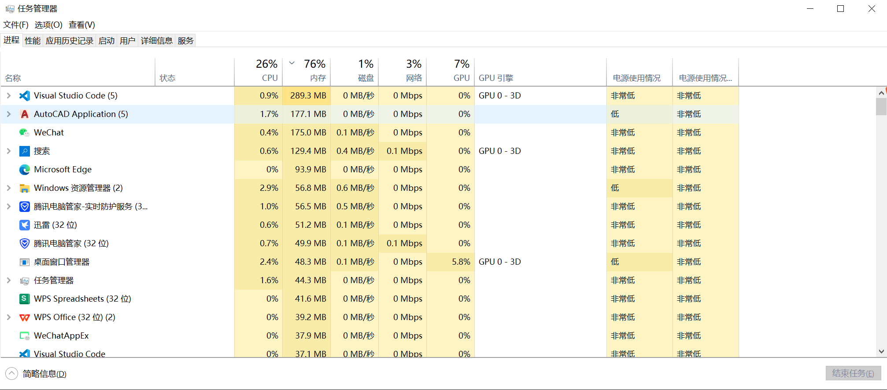

# 认识Windows窗口
- 图形用户界面(GUI)是指采用图形方式显示程序界面。

- 启动一个程序,桌面就显示一块矩形区域,被称为窗口,用户可以在窗口中操作应用程序,进行数据的管理和编辑

窗口包含如下元素


1. 标题栏和窗口标题
2. 系统菜单按钮
3. 菜单栏
4. 最小化,最大化和关闭按钮
5. 滚动条
6. 窗口边框
7. 客户区: 窗口内部的矩形区域, 指出了标题栏,菜单栏,工具栏,状态栏,滚动条和边框之外的区域,程序在这里显示文本,图形,子窗口或其他信息, 非客户去:指出了客户去之外的区域,包括标题栏,菜单栏,工具栏,状态栏,股东条和边框等
8. 状态栏

一个窗口不一定就是一个程序,它可能是程序的一部分,一个程序可以创建多个子窗口,程序的主窗口都是顶级窗口, 顶级窗口(Top-Level)指父窗口是桌面的程序窗口

一个程序并不一定必须要有窗口,比如悄悄运行在后台的木马程序就不会显示一个窗口, 如果一个程序不想和用户进行交互,它可以选择不创建窗口

# 第一个窗口程序
```
#include <Windows.h>
#include <tchar.h> // _tcslen 函数需要该头文件

#pragma comment(lib, "Winmm.lob") // 播放声音的PlaySound函数需要Winmm库
// 函数声明,窗口过程
LRESULT CALLBACK WindowProc(HWND hwnd, UINT uMsg, WPARAM wParam,LPARAM lParam);

```
RegisterClassEx 注册窗口类

注册后就可以使用注册的窗口类去创建具体的窗口类了
CreateWindowEX

ShowWindows 创建之后窗口只是再内存中，在屏幕上显示窗口

UpdateWindow 刷新窗口别的布局 通过向窗口发送WM_PAINT 消息来更新窗口