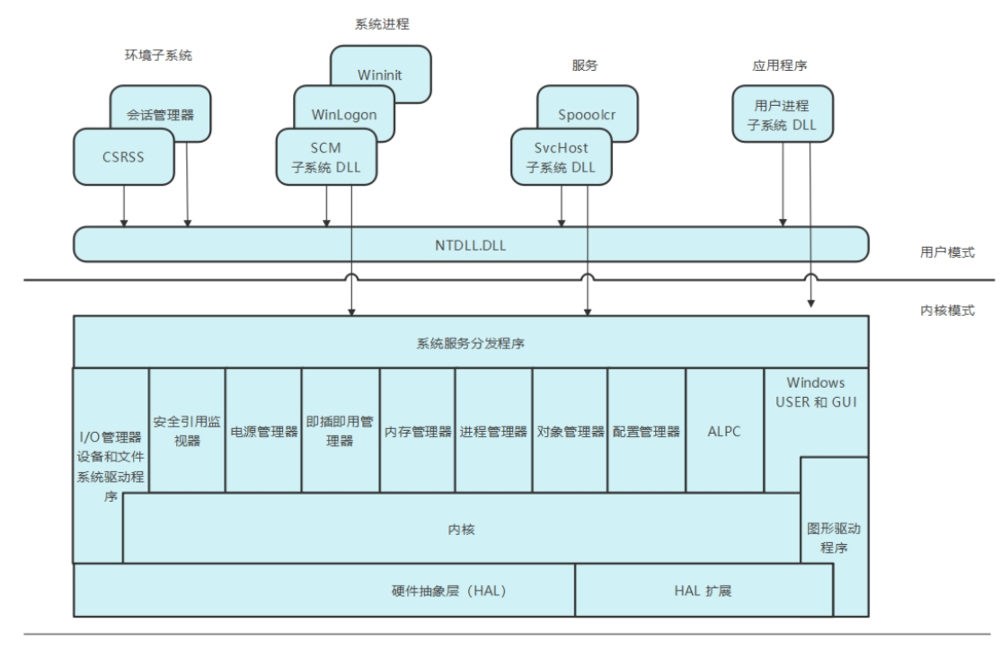
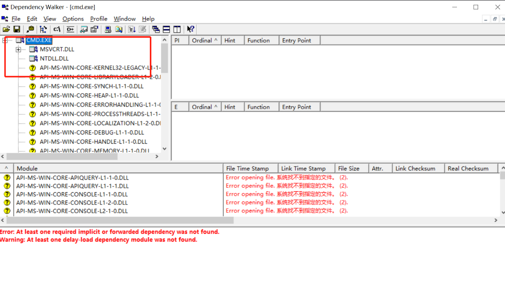
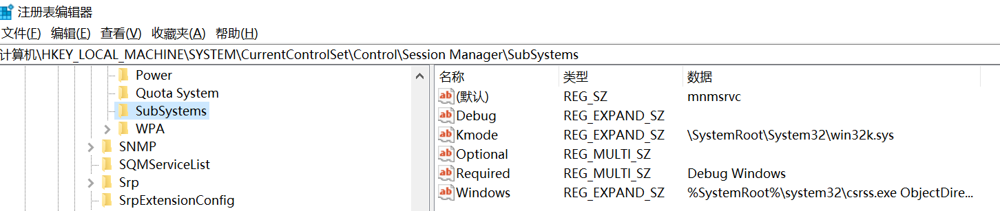
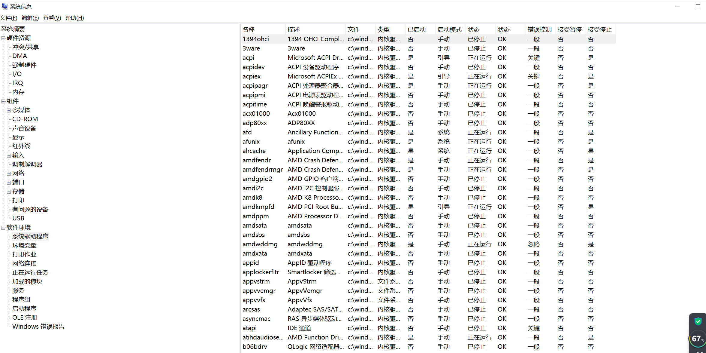
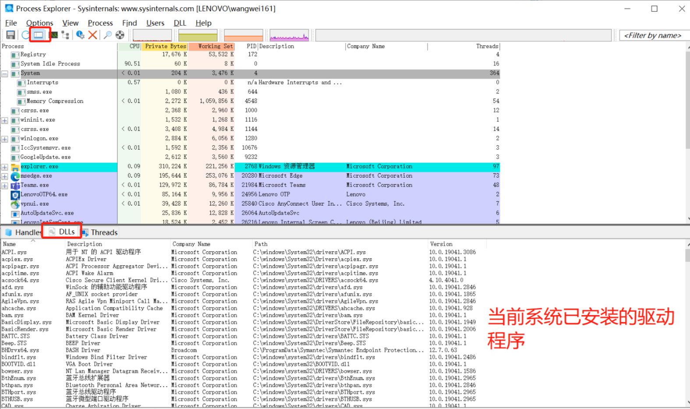
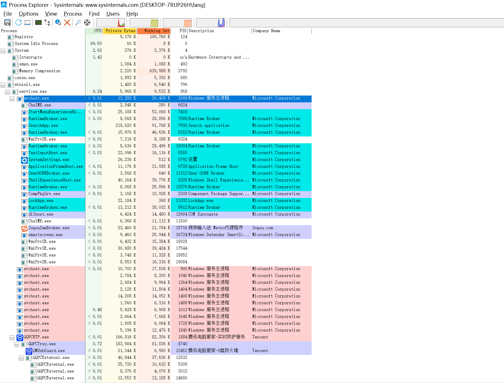

# Windows 系统架构：
由如下组成

`内核`

是操作系统的核心部分，负责管理系统资源、处理用户程序和驱动程序的请求、协调各种系统组件之间的通信。

Windows 内核分为`用户模式和内核模式`，其中内核模式是更高级别、更安全的模式，`用户程序无法直接访问内核模式`。

`驱动程序`

Windows 系统需要很多不同类型的驱动程序来管理硬件设备和提供系统功能，如网络驱动程序、声卡驱动程序、显卡驱动程序等。这些驱动程序运行在`内核模式`下，可以访问系统的底层资源和硬件设备。

`用户模式`

Windows 系统中运行应用程序的模式。在用户模式下，应用程序可以访问一些系统资源，如文件系统、网络、进程和线程等，但不能直接访问内核模式或底层硬件设备。

`Windows API`

一组应用程序接口，用于访问 Windows 操作系统的各种资源和功能。Windows API 可以在任何编程语言中使用，包括 C/C++、Java、Python 和 C# 等。

`用户界面`

包括桌面、任务栏、窗口、菜单和对话框等组件。这些组件通过 Windows API 和用户模式实现，提供了用户与操作系统进行交互和操作的方式。

Windows 分为`用户模式`和`内核模式`两部分。下面是整体架构图：

# 整体架构图

# 用户模式包含如下组件
### 用户进程
分为
- Windows 的 32 位或 64 位（Windows 8 和后续版本中，在 Windows 运行时的基础上运行的 Windows 应用也属于此类）进程。
- Windows 3.1 和 MS-DOS 的 16 位进程
- POSIX 的 32 位或 64 位进程(Windows 8 已不支持)
### 服务进程
承载了Windows服务,如Task Scheduler和Print Spooler服务

通常来说，服务需要能在用户不登录的情况下运行，很多 Windows 服务器应用。如 Microsoft SQL Server 和 Microsoft Exchange Server 也包含了以服务方式运行的组件。
### 系统进程
静态或硬编码的进程,例如非Windows服务进程的登录进程和会话管理器。也就是说,这些进程并非由服务控制管理器启动。
### 环境子系统服务器进程
实现了操作系统系统环境支持部分的进程

### 子系统DLL和NTDLL.DLL
服务进程和用户进程无法直接调用原生的Windows操作系统服务, 通过一个或多个子系统动态链接库(DLL),再通过Ntdll.dll完成调用

# Windows内核模式组件
在 Windows 中，用户应用程序无法直接调用原生的 Windows 操作系统服务，而是需要通过一个或多个子系统动态链接库（DLL）调用。子系统 DLL 的作用在于将文档化的函数转换为相应的内部（通常未文档化）原生系统服务调用，这些调用通常是在 Ntdll.dll 中实现的。这种转换可能涉及，也可能不涉及将消息发送给用户进程提供服务的环境子系统进程。

### 执行体
操作系统基础服务, 如内存管理,进程和线程管理,安全性,I/O,网络以及进程间通信
### Windows内核
包含操作系统函数,例如线程调度,中断和异常分发,多处理器同步,内核还提供了一系列例程和基本对象
### 设备驱动程序
将用户I/O函数调用转换成特定硬件设备I/O请求的硬件设备驱动程序,以及文件系统和网络驱动程序等非硬件设备驱动程序
### 硬件抽象层(HAL)
负责将内核,设备驱动程序以及执行体与具体平台相关差异(例如不同主板)进行隔离
### 窗口和图形系统
实现用户界面(GUI)功能

# 重要的系统组件

下图是 Windows 核心系统架构和组件。

从上图中可以看 Windows 操作系统环境中重要的几个系统组件分别是：

- 环境子系统和子系统 DLL
- 其他子系统
- 执行体
- 内核
- 硬件抽象层
- 设备驱动程序
- 系统进程

下面对上述内容分析进行详细的说明和介绍。

# 环境子系统和子系统 DLL
子系统可以访问 Windows 原生服务的不同子集。这意味着在一个子系统的基础上建立的应用程序所能执行的某个操作，可能无法被建立在另一个子系统的基础上的应用程序做到。例如，Windows 应用程序无法使用 SUA 的 fork 函数。

每个可执行映像（.exe）都会绑定到唯一的子系统。映像运行时，负责创建进程的代码会在映像头部检查子系统的类型代码，进而将新建进程告知给正确的子系统。该类型代码可以使用 Microsoft Visual Studio 的 linker 命令中的 /SUBSYSTEM linker 选项来制定（或使用工程属性中 Linker/System 属性页的 SubSystem 选项来指定）。

如前所述，用户应用程序不会直接调用 Windows 系统服务，而是要通过一个或多个子系统 DLL 来进行。这些库导出的接口都有相应的文档说明，链接到对应子系统的程序均可调用。例如，Windows 子系统 DLL （如 Kernel32.dll、Advapi32.dll、User32.dll 和 Gdi32.dll）实现了 Windows API 函数，SUA 子系统 DLL（Psxdll.dll）可实现 SUA API 函数。

这里，可以使用 Dependency Walker 工具（Dependency.exe）来查看映像文件的子系统类型。

分别查看 Windows 操作系统自带的 Notepad.exe 和 CMD.exe。

 
可以看出，Notepad.exe 的依赖 DLL 和 CMD.exe 的依赖 DLL 完全不一样。并且 Notepad.exe 由于是 GUI 应用程序会依赖 `GDI32.DLL`，而 CMD.exe 就很简单只依赖最基础的 `NTDLL.DLL` 库。

# 子系统的启动
子系统是由`会话管理器（Smss.exe）`进程启动的。子系统的启动信息存储在注册表 `HKLM\SYSTEM\CurrentControlSet\Control\Session Manager\SubSystems` 键下。

图中的 Required 键值列出了系统引导时加载的子系统。该值包含两个字符串：Windows 和 Debug。

Windows 值包含了 Windows 子系统的文件规范，其中 Csrss.exe 代表了客户局端/服务器运行时子系统。

Debug 值为空（该值从 Windows XP 开始就不需要了，单位了维持兼容性依然保留），因此不会生效。

optional 值代表可选的子系统，在本例子中同样为空，因为 Windows 10 已经无法再使用 SUA。原本可用的使用，将通过 POSIX 的数值指向另一个值，进而指向 Psxss.exe（POSIX 子系统进程）。Optional 的值均为“按需加载”的，这意味着会在首次遇到 POSIX 映像的时候再开始加载。Kmode 注册表值包含 Windows 子系统内核模式部分的文件名（Win32K.sys）。

# 设备驱动程序

设备驱动程序是一种可加载的内核模式模块（其文件通常使用 `.sys` 扩展），它在 I/O 管理器和相关硬件之间建立了接口。设备驱动程序运行在`内核模式`下。

设备驱动程序主要包含以下几种类型：

`硬件设备驱动程序`

使用 HAL 操作硬件将输出写入物理设备或网络，或从中获取输入。硬件设备驱动程序包含很多类型，如总线驱动程序、人机接口驱动程序、大容量存储设备驱动程序等。

`文件系统驱动程序`

是指接收面向文件 I/O 请求，并将其转换为面向特定设备 I/O 请求的 Windows 驱动程序。

`文件系统筛选器驱动程序`

包括执行磁盘镜像和加密、扫码查找病毒、拦截 I/O 请求，以及在将 I/O 传递到下一层之前执行附加处理操作的驱动程序。

`网络重定向和服务器`

这种文件系统驱动程序分别负责将文件系统 I/O 请求传递到网络上的其他计算机，或接收其他计算机通过网络传递来的请求。

`协议驱动程序`

负责实现网络协议，例如 TCP/IP、NetBEUI 和 IPX/SPX。

`内核流式筛选器驱动程序`

连接在一起对数据流进行信号处理，例如录制或播放音视频。

`软件驱动程序`

这种内核模块将代表某些用户模式进程执行只能在内核模式下执行的操作。

可以通过 Msinfo32.exe 查看本机已安装的设备驱动程序。

 
 使用 process explorer 工具也可以通过 system 进程查看当前加载的设备驱动程序。

# 系统进程

每一个 Windows 10 系统都会包含一些特殊的系统进程。它们并没有运行用户模式的可执行文件，这类进程称为最小进程

### `Idle 进程`

 为每颗 CPU 包含一个线程，用于占用空闲的 CPU 时间

### `System 进程`
包含大部分内核模式系统线程和句柄

### `secure system` 进程
包含 VTL1 下安全内核的地址空间

### memory compression 进程
包含用户模式进程压缩后的工作量

### 会话管理器（Smss.exe）

### Windows 子系统（Csrss.exe）

### 会话初始化（Wininit.exe）

### `Logon 进程（Winlogon.exe）`

### 服务控制管理器（services.exe）及其创建的子服务进程
例如系统提供的常规服务宿主进程（Svchost.exe）

### 本地安全认证服务（Lsass.exe）

### 启用 Credential Guard 后隔离的本地安全认证服务器（Lsaiso.exe）

打开 `Process explorer` 查看进程树来了解上述这些进程都是谁创建的，有助于了解每个进程的来源。

