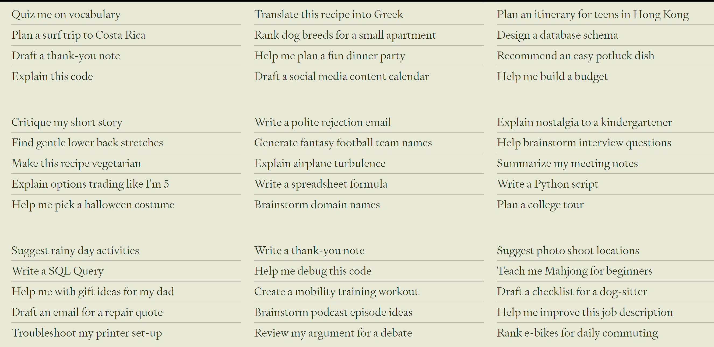

OpenAI, 作为一家在AI领域处于绝对领先地位的研究实验室和公司，拥有众多领先技术和研究成果，主要包括如下产品：

# 1. ChatGPT
OpenAI在2022年推出的全新聊天机器人模型，基于GPT3.5通过人类反馈的强化学习微调而来

它在自然语言理解和生成方面取得了显著进步, 
在对话中表现出极高的智能水平，提供准确、有用的回答。

可以向它提出任何问题,它都会给出准确合理的回答

可以看,听和说

- 比如发送图片让它帮我们分析图片的内容
- 输入文本让它生成图片
- 可以把它当做知心姐姐进行聊天

还能做更多的事情, 比如制定旅游计划, 马拉松训练,运算器等等

# 2. GPT-4
GPT-4是一个大型的多模态模型（可接收图像和文本输入，发出文本输出），但在各种专业和学术基准上匹敌人类水平的表现。例如，它通过了模拟的律师考试，分数在应试者的前10%左右；相比之下，GPT-3.5的分数则在后10%左右。OpenAI花了6个月的时间，利用对抗性测试项目以及ChatGPT的经验，反复调整GPT-4，结果在事实性、可引导性等方面取得了有史以来最好的结果。

# 3. Voice Engine
是一项革命性的声音克隆技术，可以实现高度逼真的语音合成，甚至能模拟特定人物的声音，并且采用了水印技术追踪音频来源以及实时监控系统使用情况。

去年在微博和抖音爆火过一波，让霉霉十级中文唠家常、蔡明阿姨英伦腔讲段子的AIGC初创公司HeyGen，就是这个技术的早期采用者之一。

HeyGen通过使用Voice Engine进行视频翻译，把说话者的声音转换成多种语言，同时保留原始口音，并与面部嘴型无缝同步，形成以假乱真的数字虚拟人化身，应用于从产品营销到教学演示的各类内容。也让无数互联网用户惊呼轻松通晓十门外语不再是梦。
# 4. Sora
一种视频生成技术，它能基于用户提供的文本说明，生成长达一分钟的高清视频内容，这一技术对于电影制作、广告、教育等领域有深远影响，预示着视频生成领域的革新。

# 5. DALL-E
根据用户的文本描述创建高质量的图像，创造出丰富多彩的艺术作品和实用图形。

能理解细微差别和细节，轻松将您的想法转化为非常准确的图像。

